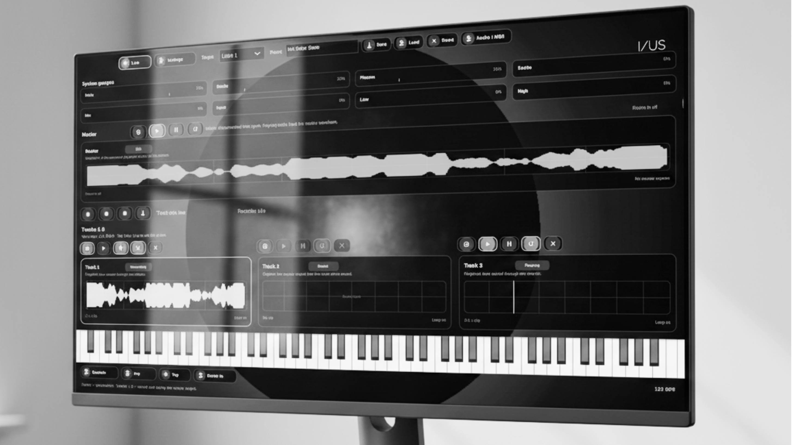
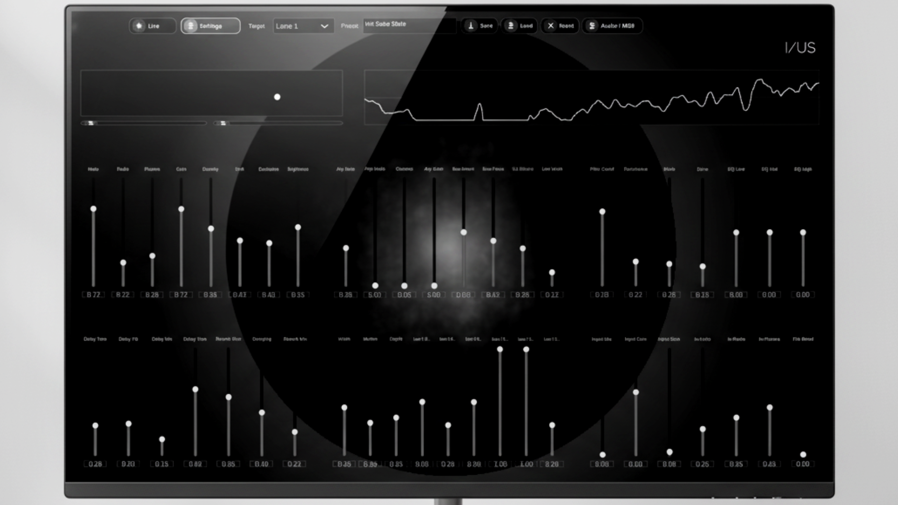

## Downloads

### v0.1a-Demo Version

- 
- 

#### Standalone App
- [Windows 64-bit](./SolarSynth%20for%20Window.exe)
- [Linux 64-bit AppImage](./SolarSynth%20for%20Linux.AppImage)

### Plugin

#### VST3
- [Windows 64-bit](./SolarSynth%20VST3%20for%20Windows.vst3.zip)
- [Linux 64-bit](./SolarSynth%20VST3%20for%20Linux.vst3.zip)

# SolarSynth

SolarSynth is a JUCE-based instrument that combines a playable three-layer synth engine, internal rhythmic trigger lanes, live performance controls, and audio capture into one desktop application and VST3 plug-in.

The project is built around a dual-page workflow:

- **Live** for performance, transport, capture, lane playback, and quick toggles
- **Settings** for deep sound design, routing, morphing, and preset management

At its core, SolarSynth blends three synthesis layers—**Helio**, **Radio**, and **Plasma**—then extends that sound with arpeggiation, filtering, EQ, delay, reverb, stereo motion, sequencer-driven routing, and external input modulation.

## What the app does

SolarSynth is designed as a performance-first instrument rather than a traditional menu-driven editor. The synth can be played from external MIDI, the built-in on-screen keyboard, or the computer keyboard. Its output can then be captured into loopable playback lanes, creating a layered workflow that sits somewhere between a synthesizer, a sketchpad looper, and a rhythm-driven performance tool.

The repository builds both:

- a **standalone desktop app**
- a **VST3 plug-in**

## Main features

### 1. Three-layer synth engine

The sound engine blends three continuously variable layers:

- **Helio** for the main tonal body
- **Radio** for unstable, burst-like upper energy
- **Plasma** for noisy, animated texture

These layers are shaped by a dedicated performance state that includes:

- Morph X / Morph Y control
- Morph Lock
- Density
- Drift
- Excitation
- Brightness
- Field Gain

### 2. Performance morphing

A dedicated **Morph Pad** lets the instrument move across different tonal positions in real time. This is intended as a central performance surface rather than a static modulation source.

Additional performance switches include:

- Sustain
- Field Hold
- Arpeggiator On/Off
- Arp Latch
- Room Input enable

### 3. Arpeggiator

SolarSynth includes an internal arpeggiator with the following controls:

- Arp Rate
- Arp Mode
- Octaves
- Arp Gate
- Latch
- Live-page Tap Tempo

The Live page mirrors the most important arp functions so timing changes can be made during performance without switching views.

### 4. Bass, filter, EQ, and spatial processing

The synth voice can be shaped further with:

- **Bass section**: Bass Amount, Bass Focus, Sub Enhance, Low Width
- **Filter section**: Filter Cutoff, Resonance, Mode, Drive
- **EQ section**: EQ Low, EQ Mid, EQ High
- **Delay section**: Delay Time, Delay Feedback, Delay Mix, Delay Tone
- **Reverb section**: Reverb Size, Reverb Damping, Reverb Mix
- **Stereo section**: Stereo Width, Stereo Motion, Stereo Depth

### 5. Live performance page

The **Live** page is the performance surface of the app. It includes:

- system gauges for engine and input activity
- a master waveform panel
- transport controls
- recording controls
- three playback/capture lanes
- an on-screen keyboard
- mirrored live toggles for Sustain, Arp, Tap Tempo, and Room Input
- room input status and arp tempo readout

The master section supports:

- Arm
- Play
- Pause
- Loop
- Stop / Panic
- Record master capture
- Stop recording
- Export captured audio to WAV

### 6. Master capture and lane playback

SolarSynth can record the master output and reuse it inside the Live page workflow.

Tracks **1–3** act as playback lanes that can:

- arm for capture
- store recorded clips
- play from the start
- pause playback
- loop clips
- clear existing clips

This makes it possible to perform the synth live, print results into lanes, and build layered playback beneath the master output.

### 7. Internal rhythm engine and lane routing

The app also includes a built-in **three-track DMS-inspired sequencer engine**. Each internal sequencer track has its own configuration and can operate in different routing modes:

- **DMS bank**
- **Synth**
- **Hybrid**

Settings-page controls expose:

- Lane 1 / 2 / 3 Mode
- Lane 1 / 2 / 3 Send

This routing system allows sequencer activity to influence how the synth behaves across the master path and the additional lane states.

### 8. External input modulation

SolarSynth includes an external input analysis path that can react to incoming audio.

Available controls include:

- Room Input
- Input Mix
- Input Gain
- Input Gate
- Input to Helio
- Input to Radio
- Input to Plasma
- File Blend

This allows live input energy to be analyzed and used as a modulation source for the synth engine while also supporting blended input-based behaviour inside the signal flow.

### 9. Presets and target-based editing

The **Settings** page is built around editable targets. You can choose whether you are editing:

- Master
- Lane 1
- Lane 2
- Lane 3

Each target keeps its own synth state, which makes it possible to prepare different variations of the instrument across the master and lane contexts.

Preset workflow includes:

- preset naming
- save preset to `.solarpreset`
- load preset from `.solarpreset`
- reset the currently selected target
- plug-in state save/restore through JUCE state serialization

## Interface overview

### Welcome screen

On launch, SolarSynth opens with a welcome overlay and bundled license view before entering the main interface.

### Live page

The Live page is focused on immediate interaction:

- performance monitoring
- waveform feedback
- transport
- recording
- playback lane control
- keyboard input
- fast performance toggles

### Settings page

The Settings page organizes the deeper editor into functional groups:

- Core tone
- Arp and bass
- Filter and EQ
- Delay and reverb
- Stereo and routing
- External input

It also includes the Morph Pad, target selector, preset controls, and output monitor.

## Input methods

SolarSynth can be played using:

- external MIDI input
- the built-in on-screen keyboard
- the computer keyboard

The computer keyboard is mapped as a playable note surface, making it possible to sketch and perform without an external controller.

## Technical overview

- **Framework:** JUCE
- **Language:** C++17
- **Formats:** Standalone, VST3
- **Audio I/O:** mono or stereo input, mono or stereo output
- **Graphics:** native JUCE UI with custom background rendering and OpenGL support enabled in the project

## Current workflow in practice

A typical session looks like this:

1. Play the synth from MIDI, the on-screen keyboard, or the computer keyboard.
2. Shape the sound on the Settings page using the morph surface and grouped controls.
3. Use the Live page to arm the master, perform, and monitor the waveform.
4. Capture material, then move that output into loopable playback lanes.
5. Layer lane playback under new live synth parts.
6. Save the current state as a preset or export the recorded result as WAV.

## License

This repository is provided under the **I/US SolarSynth Demo Personal Use License 1.1**.

It is a personal-use demo license rather than an open-source license. See `LICENSE.txt` for the full license text and usage terms.
